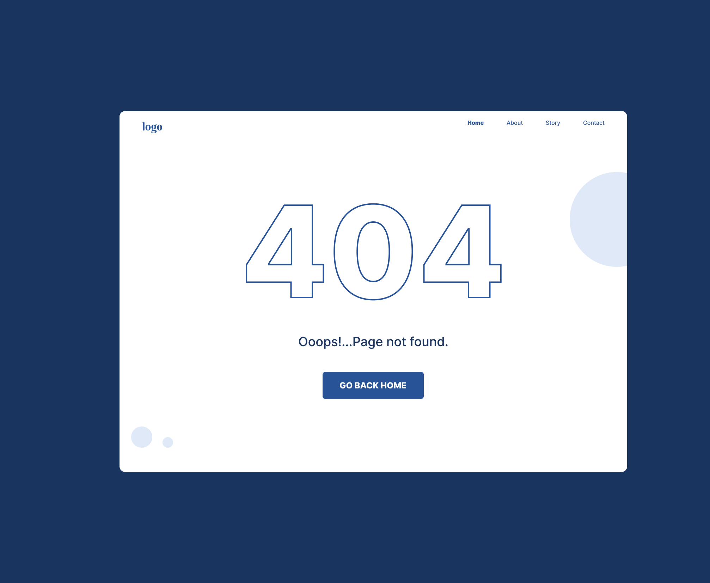
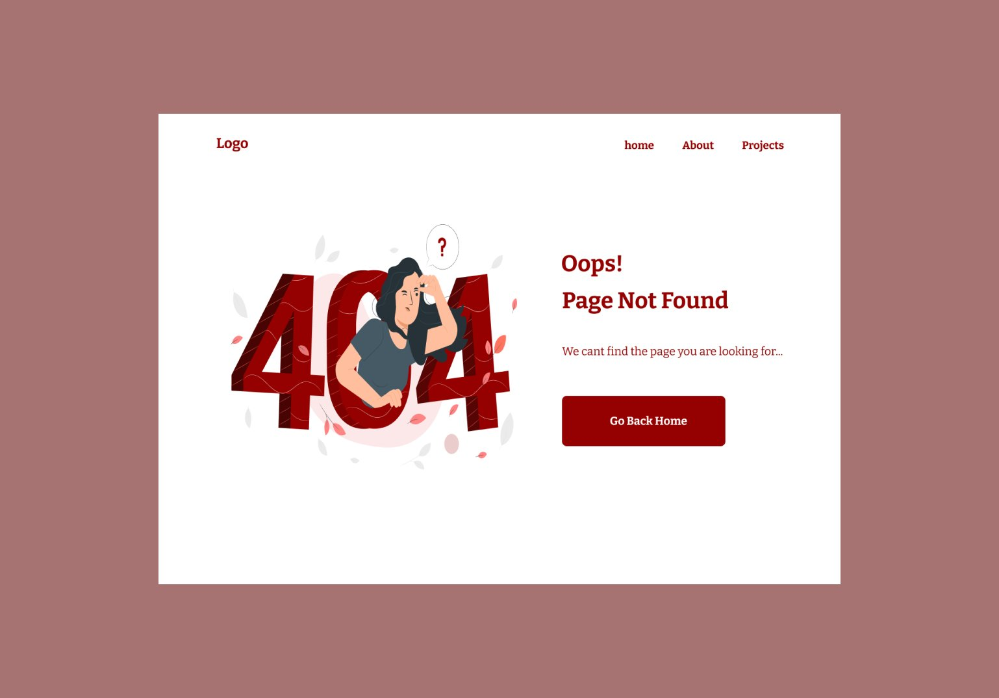
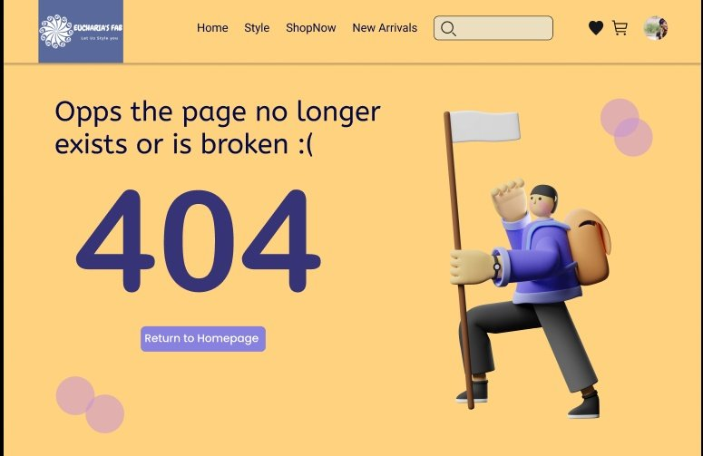
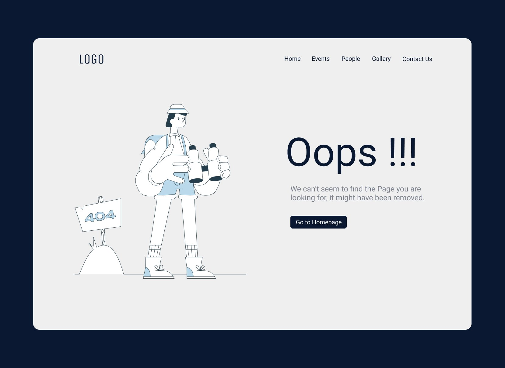
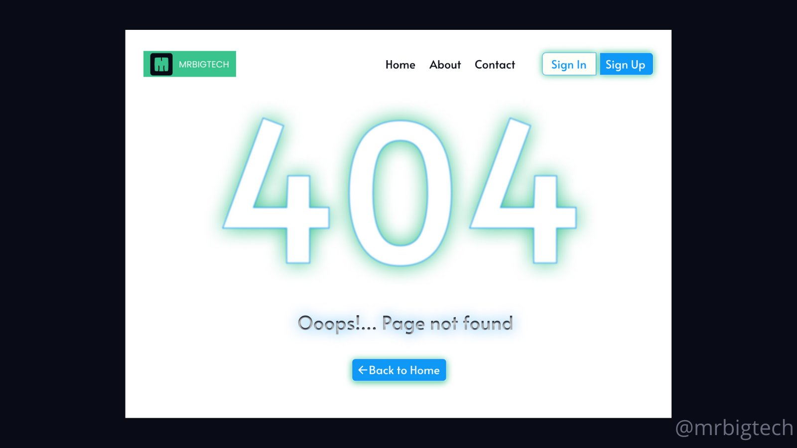
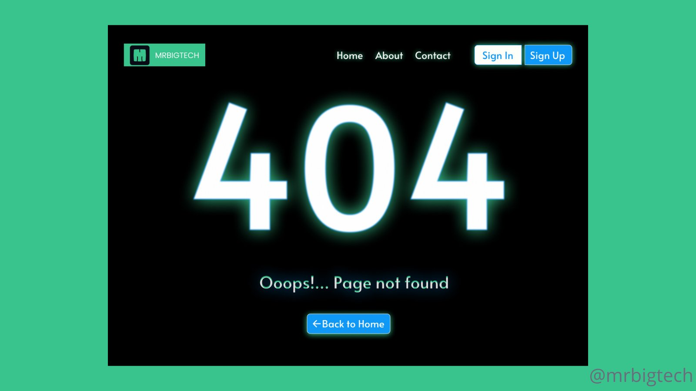

# Day 1 of UX / UI Designs - doing the HTML and CSS

## 404 page NOT FOUND pages

`404 page 1`

> Color palettes
> background-color : #19345e ;  rgb(25,52,94);
>  
> main screen
> background-color: #fffff; rgb(255,255,255)
> 
> Font Color
> color : #4e72a9 ;  rgb(78,114,169)

`404 page 2`

> Color palettes
> background-color : #19345e ;  rgb(25,52,94);
>  
> main screen
> background-color: #fffff; rgb(255,255,255)
> 
> Font Color
> color : #4e72a9 ;  rgb(78,114,169)

`404 page 3`

> Color palettes
> background-color : #19345e ;  rgb(25,52,94);
>  
> main screen
> background-color: #fffff; rgb(255,255,255)
> 
> Font Color
> color : #4e72a9 ;  rgb(78,114,169)

`404 page 4`

> Color palettes
> background-color : #19345e ;  rgb(25,52,94);
>  
> main screen
> background-color: #fffff; rgb(255,255,255)
> 
> Font Color
> color : #4e72a9 ;  rgb(78,114,169)

`404 page 5`

> Color palettes
> background-color : #19345e ;  rgb(25,52,94);
>  
> main screen
> background-color: #fffff; rgb(255,255,255)
> 
> Font Color
> color : #4e72a9 ;  rgb(78,114,169)

`404 page 6`

> Color palettes
> background-color : #19345e ;  rgb(25,52,94);
>  
> main screen
> background-color: #fffff; rgb(255,255,255)
> 
> Font Color
> color : #4e72a9 ;  rgb(78,114,169)

`404 page 7`

> Color palettes
> background-color : #19345e ;  rgb(25,52,94);
>  
> main screen
> background-color: #fffff; rgb(255,255,255)
> 
> Font Color
> color : #4e72a9 ;  rgb(78,114,169)

`404 page 4`

> Color palettes
> background-color : #19345e ;  rgb(25,52,94);
>  
> main screen
> background-color: #fffff; rgb(255,255,255)
> 
> Font Color
> color : #4e72a9 ;  rgb(78,114,169)

